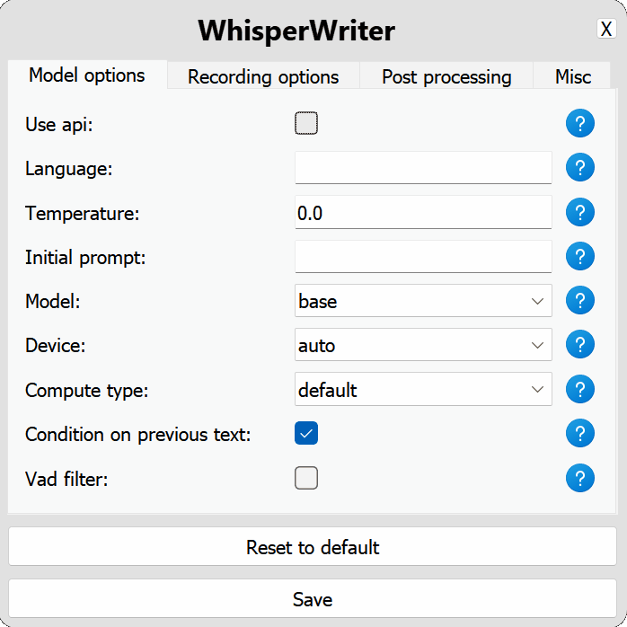

#  WhisperWriter


<p align="center">
    
</p>

WhisperWriter is a versatile speech-to-text application that leverages multiple transcription backends, including [OpenAI's Whisper model](https://openai.com/research/whisper) and [Faster Whisper](https://github.com/SYSTRAN/faster-whisper/), to automatically transcribe audio from your microphone to the active window or other configurable outputs.

### Key Features

- **Multiple Profiles**: Configure and switch between different transcription setups on-the-fly.
- **Flexible Backends**: Support for local (Faster Whisper) and API-based (OpenAI) transcription.
- **Customizable Shortcuts**: Each profile can have its own activation shortcut.
- **Various Recording Modes**: Choose from continuous, voice activity detection, press-to-toggle, or hold-to-record modes.
- **Post-Processing**: Apply customizable post-processing scripts to refine transcription output.
- **Multiple Output Methods**: Write to active window, clipboard, or custom output handlers.
- **Streaming Support**: Some backends support real-time transcription for immediate feedback.

### How It Works

WhisperWriter runs in the background, waiting for configured keyboard shortcuts. When a shortcut is pressed, the corresponding profile is activated, initiating the following process:

1. **Recording**: Audio is captured from the specified input device.
2. **Transcription**: The audio is processed by the configured backend (Faster Whisper or OpenAI).
3. **Post-Processing**: The transcribed text undergoes any specified post-processing steps.
4. **Output**: The final text is sent to the configured output method (e.g., typed into the active window).

A status window can optionally display the current stage of the process.

For more detailed information about the application's architecture and components, please refer to the [Design Document](DESIGN.md).

### Recording Modes

- **Continuous**: Records and transcribes continuously until the shortcut is pressed again.
- **Voice Activity Detection**: Stops recording after a pause in speech.
- **Press-to-Toggle**: Starts/stops recording with each shortcut press.
- **Hold-to-Record**: Records only while the shortcut is held down.

Refer to the [Configuration Options](#configuration-options) section for detailed settings.

WhisperWriter's modular design allows for easy extension with new backends, input methods, and output handlers to suit a wide range of use cases.


## Getting Started

### Prerequisites
Before you can run this app, you'll need to have the following software installed:

- Git: [https://git-scm.com/downloads](https://git-scm.com/downloads)
- Python `3.11`: [https://www.python.org/downloads/](https://www.python.org/downloads/)

If you want to run `faster-whisper` on your GPU, you'll also need to install the following NVIDIA libraries:

- [cuBLAS for CUDA 12](https://developer.nvidia.com/cublas)
- [cuDNN 8 for CUDA 12](https://developer.nvidia.com/cudnn)

<details>
<summary>More information on GPU execution</summary>

The below was taken directly from the [`faster-whisper` README](https://github.com/SYSTRAN/faster-whisper?tab=readme-ov-file#gpu):

**Note:** The latest versions of `ctranslate2` support CUDA 12 only. For CUDA 11, the current workaround is downgrading to the `3.24.0` version of `ctranslate2` (This can be done with `pip install --force-reinsall ctranslate2==3.24.0`).

There are multiple ways to install the NVIDIA libraries mentioned above. The recommended way is described in the official NVIDIA documentation, but we also suggest other installation methods below.

#### Use Docker

The libraries (cuBLAS, cuDNN) are installed in these official NVIDIA CUDA Docker images: `nvidia/cuda:12.0.0-runtime-ubuntu20.04` or `nvidia/cuda:12.0.0-runtime-ubuntu22.04`.

#### Install with `pip` (Linux only)

On Linux these libraries can be installed with `pip`. Note that `LD_LIBRARY_PATH` must be set before launching Python.

```bash
pip install nvidia-cublas-cu12 nvidia-cudnn-cu12

export LD_LIBRARY_PATH=`python3 -c 'import os; import nvidia.cublas.lib; import nvidia.cudnn.lib; print(os.path.dirname(nvidia.cublas.lib.__file__) + ":" + os.path.dirname(nvidia.cudnn.lib.__file__))'`
```

**Note**: Version 9+ of `nvidia-cudnn-cu12` appears to cause issues due its reliance on cuDNN 9 (Faster-Whisper does not currently support cuDNN 9). Ensure your version of the Python package is for cuDNN 8.

#### Download the libraries from Purfview's repository (Windows & Linux)

Purfview's [whisper-standalone-win](https://github.com/Purfview/whisper-standalone-win) provides the required NVIDIA libraries for Windows & Linux in a [single archive](https://github.com/Purfview/whisper-standalone-win/releases/tag/libs). Decompress the archive and place the libraries in a directory included in the `PATH`.

</details>

### Installation
To set up and run the project, follow these steps:

#### 1. Clone the repository:

```
git clone https://github.com/savbell/whisper-writer
cd whisper-writer
```

#### 2. Create a virtual environment and activate it:

```
python -m venv venv

# For Linux and macOS:
source venv/bin/activate

# For Windows:
venv\Scripts\activate
```

#### 3. Install the required packages:

```
pip install -r requirements.txt
```

#### 4. Run the Python code:

```
python run.py
```

#### 5. Configure and start WhisperWriter:
On first run, a Settings window should appear. Once configured and saved, another window will open. Press "Start" to activate the keyboard listener. Press the activation key (`ctrl+shift+space` by default) to start recording and transcribing to the active window.

### Configuration Options

WhisperWriter uses a configuration file to customize its behaviour. To set up the configuration, open the Settings window:

<p align="center">
    
</p>

### Global Options

These options apply to all profiles:

- `active_profiles`: List of active profiles. (Default: `[Default]`)
- `input_backend`: The input backend for detecting key presses. Options: `auto`, `evdev`, `pynput`. (Default: `auto`)
- `print_to_terminal`: Print script status and transcribed text to the terminal. (Default: `true`)
- `show_status_window`: Show the status window during operation. (Default: `true`)
- `noise_on_completion`: Play a noise after transcription is typed out. (Default: `false`)

### Profile Options

Each profile has the following configurable options:

- `name`: The name of the profile. (Default: `Default`)
- `activation_key`: Keyboard shortcut to activate this profile. Separate keys with '+'. (Default: `ctrl+shift+space`)
- `backend_type`: Transcription backend to use. Options: `faster_whisper`, `openai`. (Default: `faster_whisper`)

#### Recording Options

- `sound_device`: Numeric index of the sound device for recording. Run `python -m sounddevice` to find device numbers. (Default: `null`)
- `sample_rate`: Sample rate in Hz for recording. (Default: `16000`)
- `recording_mode`: Recording mode to use. Options: `continuous`, `voice_activity_detection`, `press_to_toggle`, `hold_to_record`. (Default: `continuous`)
- `silence_duration`: Duration in milliseconds to wait for silence before stopping recording. (Default: `900`)
- `min_duration`: Minimum duration in milliseconds for a recording to be processed. (Default: `100`)

#### Post-processing Options

- `writing_key_press_delay`: Delay in seconds between each key press when writing transcribed text. (Default: `0.005`)
- `keyboard_simulator`: Method for simulating keyboard input. Options: `pynput`, `ydotool`, `dotool`. (Default: `pynput`)
- `enabled_scripts`: List of post-processing scripts to apply (in order). (Default: `[]`)

### Backend-specific Options

#### Faster Whisper

- `model`: Model to use for transcription. Options: `tiny`, `tiny.en`, `base`, `base.en`, `small`, `small.en`, `medium`, `medium.en`, `large`, `large-v1`, `large-v2`, `large-v3`. (Default: `base`)
- `compute_type`: Compute type for the local Whisper model. Options: `default`, `float32`, `float16`, `int8`. (Default: `default`)
- `device`: Device to run the local Whisper model on. Options: `auto`, `cuda`, `cpu`. (Default: `auto`)
- `model_path`: Path to the folder containing model files. Leave empty to use online models. (Default: `null`)
- `vad_filter`: Use voice activity detection (VAD) filter to remove silence. (Default: `false`)
- `condition_on_previous_text`: Use previously transcribed text as a prompt for the next transcription. (Default: `true`)
- `temperature`: Controls randomness of transcription output. Lower values make output more focused and deterministic. (Default: `0.0`)
- `initial_prompt`: String used as an initial prompt to condition the transcription. (Default: `null`)

#### OpenAI

- `model`: Model to use for transcription. Currently only `whisper-1` is available. (Default: `whisper-1`)
- `base_url`: Base URL for the API. Can be changed to use a local API endpoint. (Default: `https://api.openai.com/v1`)
- `api_key`: Your API key for the OpenAI API. Required for API usage. (Default: `null`)
- `temperature`: Controls randomness of transcription output. Lower values make output more focused and deterministic. (Default: `0.0`)
- `initial_prompt`: String used as an initial prompt to condition the transcription. (Default: `null`)

If any configuration options are invalid or not provided, the program will use the default values.


## Known Issues

You can see all reported issues and their current status in our [Issue Tracker](https://github.com/savbell/whisper-writer/issues). If you encounter a problem, please [open a new issue](https://github.com/savbell/whisper-writer/issues/new) with a detailed description and reproduction steps, if possible.

## Roadmap
Below are features I am planning to add in the near future:
- [ ] Add VOSK backend
- [ ] Add streaming transcription
- [ ] Upgrade to QT6.
- [ ] Additional post-processing options:
  - [ ] Simple word replacement (e.g. "gonna" -> "going to" or "smiley face" -> "😊")
  - [ ] Using GPT for instructional post-processing
- [ ] Creating standalone executable file

Implemented features can be found in the [CHANGELOG](CHANGELOG.md).

## Contributing

Contributions are welcome! I created this project for my own personal use and didn't expect it to get much attention, so I haven't put much effort into testing or making it easy for others to contribute. If you have ideas or suggestions, feel free to [open a pull request](https://github.com/savbell/whisper-writer/pulls) or [create a new issue](https://github.com/savbell/whisper-writer/issues/new). I'll do my best to review and respond as time allows.

## Credits

- [OpenAI](https://openai.com/) for creating the Whisper model and providing the API. Plus [ChatGPT](https://chat.openai.com/), which was used to write a lot of the initial code for this project.
- [Guillaume Klein](https://github.com/guillaumekln) for creating the [faster-whisper Python package](https://github.com/SYSTRAN/faster-whisper).
- All of our [contributors](https://github.com/savbell/whisper-writer/graphs/contributors)!

## License

This project is licensed under the GNU General Public License. See the [LICENSE](LICENSE) file for details.
