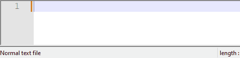

#  WhisperWriter


<p align="center">
    
</p>

WhisperWriter is a small speech-to-text app that uses [OpenAI's Whisper model](https://openai.com/research/whisper) to auto-transcribe recordings from a user's microphone.

Once started, the script runs in the background and waits for a keyboard shortcut to be pressed (`ctrl+shift+space` by default). When the shortcut is pressed, the app starts recording from your microphone. There are three options to stop recording:
- `voice_activity_detection` that stops recording once it detects a long enough pause in your speech.
- `press_to_toggle` that stops recording when the activation key is pressed again.
- `hold_to_record` that stops recording when the activation key is released.

You can change the activation key and recording mode in the [Configuration Options](#configuration-options). While recording and transcribing, a small status window is displayed that shows the current stage of the process (but this can be turned off). Once the transcription is complete, the transcribed text will be automatically written to the active window.

The transcription can either be done locally through the [faster-whisper Python package](https://github.com/SYSTRAN/faster-whisper/) or through a request to [OpenAI's API](https://platform.openai.com/docs/guides/speech-to-text). By default, the app will use a local model, but you can change this in the [Configuration Options](#configuration-options). If you choose to use the API, you will need to provide your OpenAI API key in a `.env` file, or change the base URL endpoint.

**Fun fact:** Almost the entirety of the initial release of the project was pair-programmed with [ChatGPT-4](https://openai.com/product/gpt-4) and [GitHub Copilot](https://github.com/features/copilot) using VS Code. Practically every line, including most of this README, was written by AI. After the initial prototype was finished, WhisperWriter was used to write a lot of the prompts as well!

## Getting Started

### Prerequisites
Before you can run this app, you'll need to have the following software installed:

- Git: [https://git-scm.com/downloads](https://git-scm.com/downloads)
- Python `3.11`: [https://www.python.org/downloads/](https://www.python.org/downloads/)

If you want to run `faster-whisper` on your GPU, you'll also need to install the following NVIDIA libraries:

- [cuBLAS for CUDA 11](https://developer.nvidia.com/cublas)
- [cuDNN 8 for CUDA 11](https://developer.nvidia.com/cudnn)

### Installation
To set up and run the project, follow these steps:

#### 1. Clone the repository:

```
git clone https://github.com/savbell/whisper-writer
cd whisper-writer
```

#### 2. Create a virtual environment and activate it:

```
python -m venv venv

# For Linux and macOS:
source venv/bin/activate

# For Windows:
venv\Scripts\activate
```

#### 3. Install the required packages:

```
pip install -r requirements.txt
```

#### 4. Switch between a local model and the OpenAI API:
To switch between running Whisper locally and using the OpenAI API, you need to modify the `src\config.json` file:

- If you prefer using the OpenAI API, set `"use_api"` to `true`. You will also need to either set up your OpenAI API key or change the base URL in the next step.
- If you prefer using a local Whisper model, set `"use_api"` to `false`. You may also want to change the device that the model uses; see the [Model Options](#model-options). Note that you need to have the [NVIDIA libraries installed](https://github.com/SYSTRAN/faster-whisper/#gpu) to run the model on your GPU.

```
{
    "use_api": false,    // Change this value to true to use the OpenAI API
    ...
}
```

#### 5. If using the OpenAI API, configure the environment variables:

Copy the ".env.example" file to a new file named ".env":
```
# For Linux and macOS
cp .env.example .env

# For Windows
copy .env.example .env
```
Open the ".env" file and add in your OpenAI API key:
```
OPENAI_API_KEY=<your_openai_key_here>
```
You can find your API key on the [OpenAI dashboard](https://platform.openai.com/api-keys). You will need to have available credits to use the API.

Alternatively, you can set the base URL endpoint to use a local API such as [LocalAI](https://localai.io/):
```
OPENAI_API_BASE_URL=<your_custom_url_here>
```

#### 6. Run the Python code:

```
python run.py
```

### Configuration Options

WhisperWriter uses a configuration file to customize its behaviour. To set up the configuration, modify the [`src\config.json`](src\config.json) file:

```json
{
    "use_api": false,
    "api_options": {
        "model": "whisper-1",
        "language": null,
        "temperature": 0.0,
        "initial_prompt": null
    },
    "local_model_options": {
        "model": "base",
        "device": "auto",
        "compute_type": "auto",
        "language": null,
        "temperature": 0.0,
        "initial_prompt": null,
        "condition_on_previous_text": true,
        "vad_filter": false
    },
    "activation_key": "ctrl+shift+space",
    "recording_mode": "voice_activity",
    "sound_device": null,
    "sample_rate": 16000,
    "silence_duration": 900,
    "writing_key_press_delay": 0.005,
    "noise_on_completion": false,
    "remove_trailing_period": false,
    "add_trailing_space": true,
    "remove_capitalization": false,
    "print_to_terminal": true
}
```
#### Model Options
- `use_api`: Set to `true` to use the OpenAI API for transcription. Set to `false` to use a local Whisper model. (Default: `false`)
- `api_options`: Contains options for the OpenAI API. See the [API reference](https://platform.openai.com/docs/api-reference/audio/create?lang=python) for more details.
  - `model`: The model to use for transcription. Currently only `whisper-1` is available. (Default: `"whisper-1"`)
  - `language`: The language code for the transcription in [ISO-639-1 format](https://en.wikipedia.org/wiki/List_of_ISO_639-1_codes). (Default: `null`)
  - `temperature`: Controls the randomness of the transcription output. Lower values (e.g., 0.0) make the output more focused and deterministic. (Default: `0.0`)
  - `initial_prompt`: A string used as an initial prompt to condition the transcription. [Here's some info on how it works](https://platform.openai.com/docs/guides/speech-to-text/prompting). Set to null for no initial prompt. (Default: `null`)
- `local_model_options`: Contains options for the local Whisper model. See the [function definition](https://github.com/openai/whisper/blob/main/whisper/transcribe.py#L52-L108) for more details.
  - `model`: The model to use for transcription. See [available models and languages](https://github.com/openai/whisper#available-models-and-languages). (Default: `"base"`)
  - `device`: The device to run the local Whisper model on. Options include `cuda` for NVIDIA GPUs, `cpu` for CPU-only processing, or `auto` to let the system automatically choose the best available device. (Default: `auto`)
  - `compute_type`: The compute type to use for the local Whisper model. [More information can be found here.](https://opennmt.net/CTranslate2/quantization.html) (Default: `auto`)
  - `language`: The language code for the transcription in [ISO-639-1 format](https://en.wikipedia.org/wiki/List_of_ISO_639-1_codes). (Default: `null`)
  - `temperature`: Controls the randomness of the transcription output. Lower values (e.g., 0.0) make the output more focused and deterministic. (Default: `0.0`)
  - `initial_prompt`: A string used as an initial prompt to condition the transcription. [Here's some info on how it works](https://platform.openai.com/docs/guides/speech-to-text/prompting). Set to null for no initial prompt. (Default: `null`)
  - `condition_on_previous_text`: Set to `true` to use the previously transcribed text as a prompt for the next transcription request. (Default: `true`)
  - `vad_filter`: Set to `true` to use [a voice activity detection (VAD) filter](https://github.com/snakers4/silero-vad) to remove silence from the recording. (Default: `false`)
#### Customization Options
- `activation_key`: The keyboard shortcut to activate the recording and transcribing process. (Default: `"ctrl+shift+space"`)
- `recording_mode`: The recording mode to use. Options include `voice_activity_detection` to use voice activity detection to determine when to stop recording, or `press_to_toggle` to start and stop recording by pressing the activation key, or `hold_to_record` to start recording when the activation key is pressed down and stop recording when the activation key is released. (Default: `"voice_activity"`)
- `sound_device`: The name of the sound device to use for recording. Set to `null` to let the system automatically choose the default device. To find a device number, run `python -m sounddevice`. (Default: `null`)
- `sample_rate`: The sample rate in Hz to use for recording. (Default: `16000`)
- `silence_duration`: The duration in milliseconds to wait for silence before stopping the recording. (Default: `900`)
- `writing_key_press_delay`: The delay in seconds between each key press when writing the transcribed text. (Default: `0.005`)
- `noise_on_completion`: Set to `true` to play a sound when the transcription is complete. (Default: `false`)
- `remove_trailing_period`: Set to `true` to remove the trailing period from the transcribed text. (Default: `false`)
- `add_trailing_space`: Set to `true` to add a trailing space to the transcribed text. (Default: `true`)
- `remove_capitalization`: Set to `true` to convert the transcribed text to lowercase. (Default: `false`)
- `print_to_terminal`: Set to `true` to print the script status and transcribed text to the terminal. (Default: `true`)
- `hide_window`: Set to `true` to hide the status window.

If any of the configuration options are invalid or not provided, the program will use the default values.

## Known Issues

You can see all reported issues and their current status in our [Issue Tracker](https://github.com/savbell/whisper-writer/issues). If you encounter a problem, please [open a new issue](https://github.com/savbell/whisper-writer/issues/new) with a detailed description and reproduction steps, if possible.

## Roadmap
Below are features I am planning to add in the near future:
- [ ] Restructuring configuration options to reduce redundancy
- [x] Update to use the latest version of the OpenAI API
- [ ] Additional post-processing options:
  - [ ] Simple word replacement (e.g. "gonna" -> "going to" or "smiley face" -> "😊")
  - [ ] Using GPT for instructional post-processing
- [ ] Updating GUI
- [ ] Creating standalone executable file

Below are features not currently planned:
- [ ] Pipelining audio files

Implemented features can be found in the [CHANGELOG](CHANGELOG.md).

## Contributing

Contributions are welcome! I created this project for my own personal use and didn't expect it to get much attention, so I haven't put much effort into testing or making it easy for others to contribute. If you have ideas or suggestions, feel free to [open a pull request](https://github.com/savbell/whisper-writer/pulls) or [create a new issue](https://github.com/savbell/whisper-writer/issues/new). I'll do my best to review and respond as time allows.

## Credits

- [OpenAI](https://openai.com/) for creating the Whisper model and providing the API. Plus [ChatGPT](https://chat.openai.com/), which was used to write a lot of the initial code for this project.
- [Guillaume Klein](https://github.com/guillaumekln) for creating the [faster-whisper Python package](https://github.com/SYSTRAN/faster-whisper).
- All of our [contributors](https://github.com/savbell/whisper-writer/graphs/contributors)!

## License

This project is licensed under the GNU General Public License. See the [LICENSE](LICENSE) file for details.
